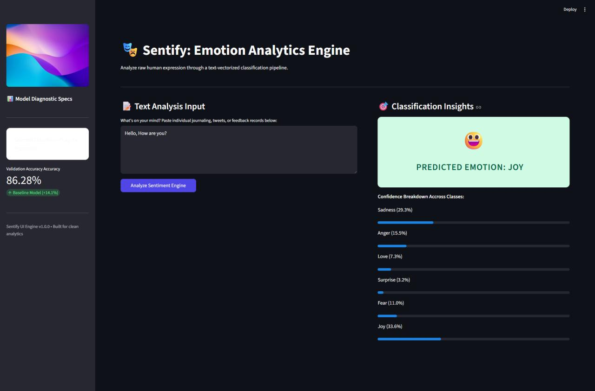

# Sentify: End-to-End Emotion Analytics

Built and deployed an end-to-end NLP application that analyzes and predicts human emotions from text using machine learning classification models.

---

## 📸 Demo



---

## 🧠 What it does

Enter a sentence and the model predicts the underlying emotion in real time through a Streamlit web app.

---

## ⚙️ Key Features

• Cleaned and preprocessed raw text using NLP techniques (noise removal, stop-word filtering, normalization)  
• Converted text into numerical features using TF-IDF vectorization  
• Trained multiple Scikit-learn classification models and compared performance  
• Selected the best-performing model for deployment  
• Saved pipeline using Joblib for fast inference  
• Built an interactive Streamlit UI for real-time predictions  

---

## 🧪 Model Workflow


Input Text → Preprocessing → TF-IDF Vectorization → ML Model → Prediction


---

## 🛠️ Tech Stack

Python · Pandas · NumPy · Scikit-learn · NLP (TF-IDF) · Streamlit · Joblib

---

## ▶️ Run Locally

```bash
pip install -r requirements.txt
streamlit run app.py
